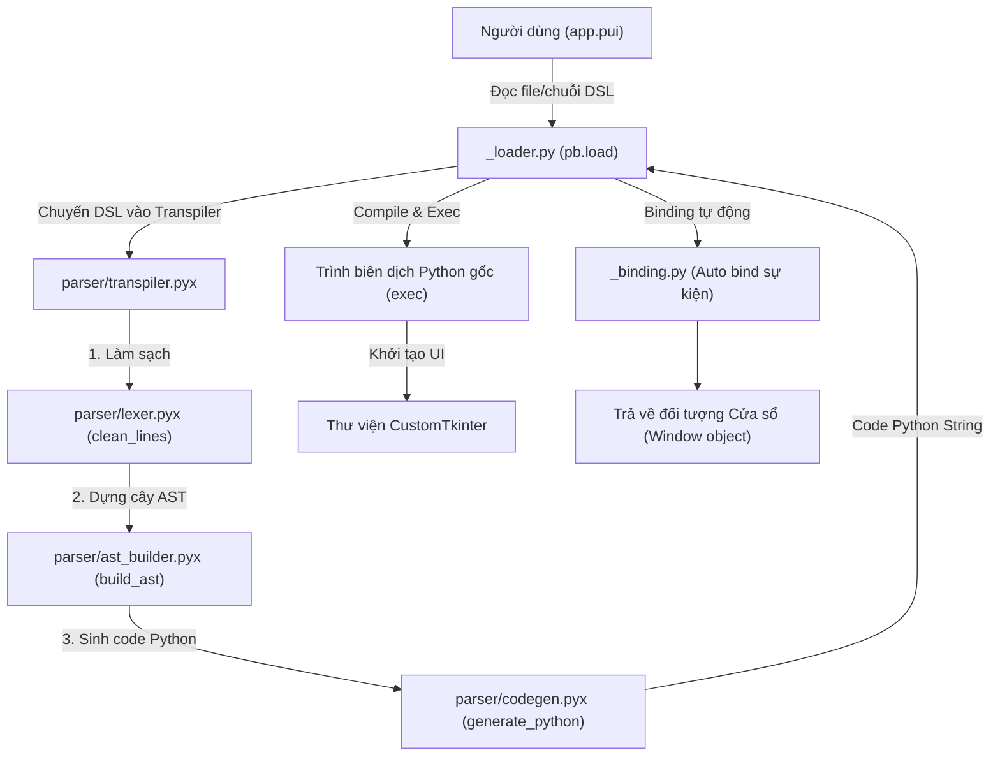
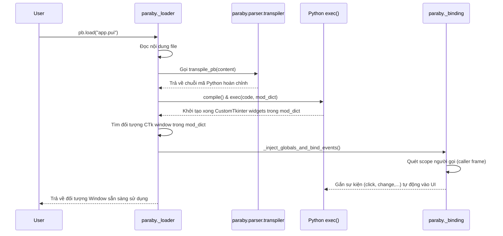

# Hướng dẫn Phát triển Paraby UI Framework (Developer Guide)

## Phần 1: Tổng quan
Paraby là một UI Framework sử dụng ngôn ngữ DSL (Domain-Specific Language) để viết giao diện GUI rút gọn (cú pháp lấy cảm hứng từ Flutter/CSS). Trình biên dịch của Paraby sẽ chuyển đổi (transpile) mã DSL này thành mã nguồn Python thật sử dụng thư viện `customtkinter` (CustomTkinter) ở bên dưới.
Việc biên dịch và thực thi diễn ra tự động hoàn toàn ở thời gian chạy (runtime) trên bộ nhớ (in-memory execution), không sinh ra file vật lý dư thừa trừ khi dùng công cụ export.

### Sơ đồ Kiến trúc Tổng


## Phần 2: Sơ đồ luồng thực thi khi gọi `pb.load()`



## Phần 3: Bảng chi tiết TỪNG FILE

| File | Số dòng | Chức năng chính (1-2 câu) | Thư viện/module dùng (import) | Trích xuất từ / quan hệ với file khác | Hàm/class quan trọng nhất |
|---|---|---|---|---|---|
| `src/paraby/__init__.py` | 36 | File khởi tạo module chính, re-export các API tĩnh để public ra ngoài. | `runtime`, `parser`, `_finder`, `_dialogs`, `_loader` | Re-export từ các file con (tách ra để tuân thủ SRP). | Các API re-export |
| `src/paraby/__main__.py` | 12 | Điểm neo chạy lệnh cli `python -m paraby`. | `sys`, `.cli` | Gọi tới `cli.main()`. | `main` |
| `src/paraby/_binding.py` | 173 | Xử lý logic tự động gán sự kiện Python vào UI widget sử dụng Frame Inspection. | `inspect`, `types`, `customtkinter` | Tách ra từ `__init__.py` cũ. | `_inject_globals_and_bind_events` |
| `src/paraby/_dialogs.py` | 15 | Hỗ trợ các hộp thoại nhanh như `alert`, `confirm`, `prompt`. | `tkinter.messagebox`, `tkinter.simpledialog` | Tách ra từ `__init__.py` cũ. | `alert`, `confirm`, `prompt` |
| `src/paraby/_finder.py` | 49 | Import Hook tùy biến giúp import trực tiếp file `.pui` bằng lệnh `import`. | `sys`, `importlib.machinery`, `importlib.abc` | Tách ra từ `__init__.py` cũ. | `ParabyFinder`, `register` |
| `src/paraby/_loader.py` | 116 | Quản lý vòng đời nạp file `.pui`, transpile, execute code. | `customtkinter`, `inspect`, `.parser.transpiler` | Phụ thuộc chính vào transpiler và `_binding.py`. | `load`, `run`, `build` |
| `src/paraby/cli.py` | 100 | Cung cấp giao diện CLI in ra cheat sheet hướng dẫn khi gõ `paraby app.pui`. | `sys`, `re`, `paraby`, `.parser.*` | Dùng AST để duyệt trực tiếp không qua biên dịch. | `show_help` |
| `src/paraby/colors.py` | 56 | Bảng định nghĩa hằng số màu sắc tuỳ chỉnh (hiện ít sử dụng trực tiếp). | - | Được dùng bởi một số style mặc định. | - |
| `src/paraby/events.py` | 29 | Wrapper chuẩn hoá sự kiện UI sang mô hình sự kiện Paraby. | - | Hỗ trợ `_binding.py`. | `EventWrapper` |
| `src/paraby/patch.py` | 96 | Monkey-patch `customtkinter` để giả lập các thuộc tính ma thuật (`.text`, `.value`, tự tìm UI auto-name). | `customtkinter` | Gọi ở runtime. | `patch_classes`, `KNOWN_TYPES` |
| `src/paraby/runtime.py` | 9 | Cung cấp hàm bọc ngoài cho quá trình tạo Widget và Window. | `window`, `widgets`, `events` | Hợp nhất logic ở runtime. | `create_window`, `create_widget` |
| `src/paraby/widgets.py` | 225 | Đóng gói và ánh xạ các class `CTk...` thành Widget chuẩn hoá của Paraby. | `customtkinter`, `Pillow` | Cung cấp `WIDGET_CLASSES`. | `WIDGET_CLASSES` |
| `src/paraby/window.py` | 49 | Đóng gói cấu hình gốc cho Cửa sổ `CTk`, set theme. | `customtkinter`, `darkdetect` | Dùng trong `runtime.py`. | `ParabyWindow` |
| `src/paraby/type_stubs.pyi` | 65 | Dummy file chứa các class định nghĩa cho IDE autocomplete. | - | Tách ra từ `__init__.py` cũ. | `window`, `label`, `btn`,... |
| `src/paraby/parser/__init__.py` | 1 | Khởi tạo module parser. | `.transpiler` | Re-export `transpile_pb`. | - |
| `src/paraby/parser/constants.py` | 34 | Chứa hằng số dùng ở quá trình compile, như `WIDGET_ALIASES`. | - | Dùng bởi `ast_builder.pyx`. | `WIDGET_ALIASES` |

### Các file Cython lõi (Pipeline Transpiler)

| File | Số dòng | Chức năng chính | Input / Output |
|---|---|---|---|
| `src/paraby/parser/lexer.pyx` | 87 | Xử lý mảng raw text, dọn khoảng trắng rác, loại bỏ ký tự comment `#`. | Input: `str` DSL nguyên thuỷ. Output: mảng `list` các dòng text đã dọn dẹp. |
| `src/paraby/parser/ast_builder.pyx` | 170 | Biến mảng text thành Cây Cú pháp Trừu tượng (AST). Quản lý cấu trúc lồng nhau (window -> loop -> widget -> event). | Input: `list` (lines). Output: Mảng `ASTNode`. |
| `src/paraby/parser/codegen.pyx` | 155 | Sinh chuỗi Python code từ cây AST. Giải quyết auto-name, hàm callback tương đối. Hỗ trợ đa cửa sổ `def New_{var}():`. | Input: Mảng `ASTNode`. Output: `str` (chuỗi Python code hợp lệ). |
| `src/paraby/parser/transpiler.pyx` | 15 | Kết nối Lexer -> AST -> CodeGen thành 1 luồng duy nhất thông qua hàm `transpile_pb`. | Input: `str`. Output: `str`. |

Ví dụ Transpile:
**Input (DSL)**:
```paraby
win = window(
    btn(text: click)
)
```
**Output (Python)**:
```python
import customtkinter as ctk
import paraby as pb
def New_win():
    win = pb.create_window(...)
    btn_1 = pb.create_widget(win, 'btn', text="click")
    win.btn_1 = btn_1
    pb.place_widget(btn_1)
    return win
...
```

## Phần 4: Cách chạy / build / test dự án
Vì parser sử dụng Cython (hiệu năng cao, mã hoá module) nên bắt buộc phải build thư viện nội bộ trước khi chạy.
Sử dụng chính xác các lệnh sau (như trên CI):

**1. Cài đặt Dependencies:**
```bash
python -m pip install --upgrade pip
pip install pytest customtkinter Cython darkdetect Pillow --break-system-packages
```

**2. Build Cython Extensions (Bắt buộc sau mỗi lần sửa parser):**
```bash
python setup.py build_ext --inplace --force
```

**3. Chạy Test (Test thuần logic không cần mở GUI):**
```bash
python -m pytest test_parser.py test_loop.py test_loop_events.py test_cython/test_sync.py test_advanced.py -v
```

## Phần 5: Các quyết định thiết kế quan trọng cần biết trước khi sửa code

1. **Vì sao `loop()` là node thật trong AST (không phải pseudo-node)?**
   - Giải thích: Nếu `loop()` chỉ là vòng lặp giả (nhúng thẳng for vào khối UI cha), biến con và sự kiện liên quan sẽ gặp lỗi tra cứu parent scope ở cây AST. Đưa `loop()` thành một cấp độ lồng nhau chính thống trong AST giúp việc gắn kết event block (`this_expr`) trở nên cô lập, chính xác hơn đối với list biến ảo `this`.

2. **Vì sao event-block dùng thụt lề tương đối?**
   - Giải thích: Một file UI có thể có thẻ lồng nhiều bậc tuỳ ý. Nếu dùng thụt lề tuyệt đối (vd "lùi vào dòng 1 phải là X khoảng trắng") sẽ làm sai lệch khi widget nằm quá sâu trong 10 lớp `frame`. Bằng cách dùng "khoảng trắng so với dòng khai báo khối event", code thụt lề tương đối cho phép parse code Python nội tuyến rất dễ dàng và chống vỡ indent block.

3. **Vì sao `if click:` trực tiếp trong `loop()` sẽ sinh lỗi?**
   - Giải thích: Do vòng lặp không tạo ra một widget UI duy nhất mà sinh ra N widgets. Nếu không định danh rõ (`if ten_widget.click`), trình biên dịch sẽ không biết gắn event block này vào "Nút" hay "Khung" bên trong vòng lặp. Việc raise ValueError chặn sai sót từ đầu.

4. **Cơ chế Monkey-patch toàn cục (`patch.py`)**
   - Giải thích: `patch.py` can thiệp vào `__getattr__` của gốc `ctk.CTkBaseClass`. Điều này cho phép "ma thuật" gọi UI bằng tên không cần setup (`self.btn_1`) và giả lập virtual properties (`.text` thay vì `.cget("text")`). 
   - **Rủi ro:** Điều này thay đổi vĩnh viễn cấu trúc của thư viện CustomTkinter ở Python Process hiện tại. Sẽ rất nguy hiểm nếu code được nhúng chung vào dự án có sử dụng CustomTkinter gốc theo chuẩn cũ, vì nó thay đổi luồng try-catch Exception của các thuộc tính mặc định.
