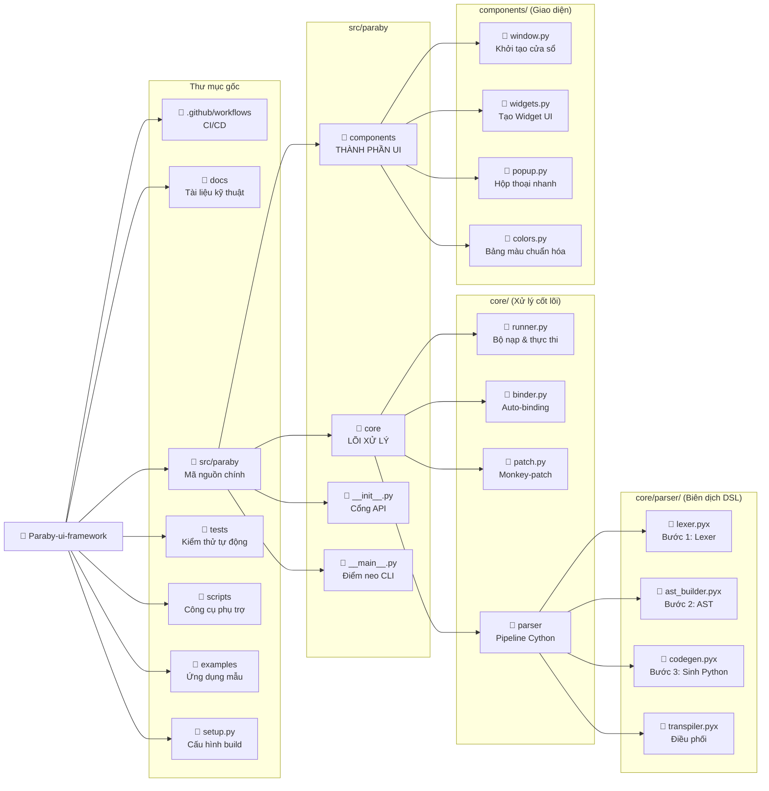
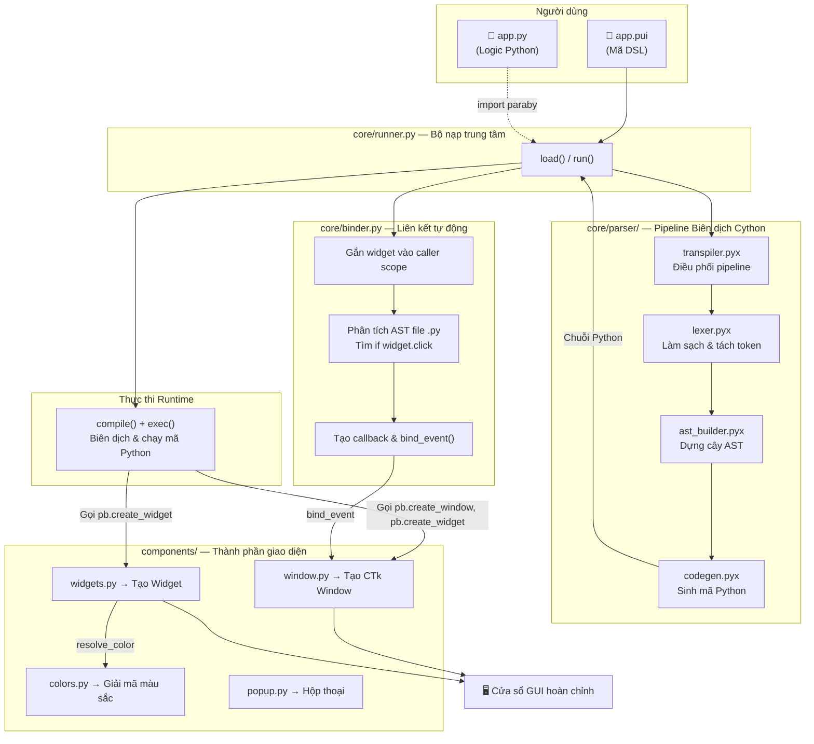
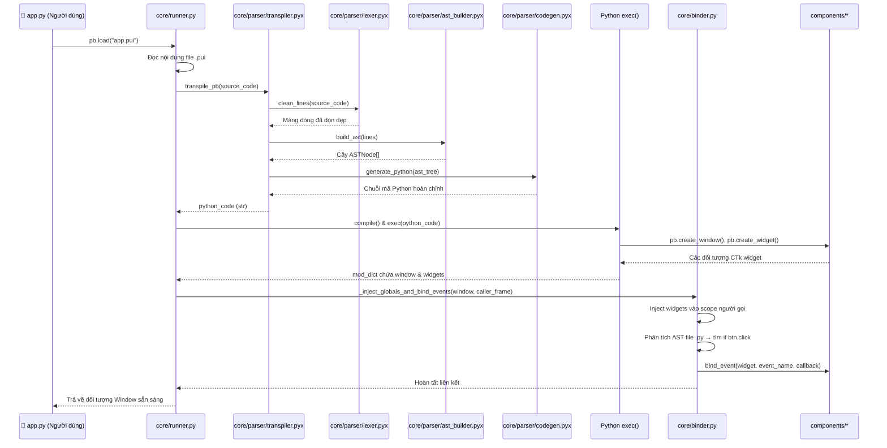

# Hướng dẫn Phát triển Paraby UI Framework v3.0 (Developer Guide)

Phần	Nội dung
Phần 1	Tổng quan kiến trúc + Cây thư mục chuẩn sau tái cấu trúc
Phần 2	2 sơ đồ Mermaid: (1) Sơ đồ luồng dữ liệu tổng graph TD — từ file .pui qua parser → exec → binder → GUI, (2) Sơ đồ tuần tự sequenceDiagram chi tiết 13 bước khi gọi pb.load()
Phần 3	Bóc tách chi tiết 23 file trong src/paraby/ theo đúng biểu mẫu: chức năng, số dòng, dependencies, nguồn gốc logic
Phần 4	Hướng dẫn build/test/chạy ứng dụng
Phần 5	4 quyết định thiết kế quan trọng (loop node, thụt lề tương đối, monkey-patch,...)
Phần 6	Bảng tổng hợp nhanh toàn bộ ~1.593 dòng code


> **Phiên bản tài liệu:** 3.0 — Cập nhật sau đợt tái cấu trúc kiến trúc (Restructured Edition)  
> **Ngôn ngữ:** Tiếng Việt  
> **Đối tượng:** Lập trình viên đóng góp mã nguồn (Contributors) và người dùng nâng cao (Advanced Users)

---

## Phần 1: Tổng quan

Paraby là một **Declarative UI Framework** sử dụng ngôn ngữ DSL (Domain-Specific Language) tùy biến để viết giao diện GUI cực kỳ ngắn gọn — lấy cảm hứng từ Flutter và CSS. Trình biên dịch nội bộ của Paraby sẽ **chuyển đổi (transpile)** mã DSL (file `.pui`) thành mã nguồn Python thật, sử dụng thư viện `CustomTkinter` ở tầng dưới cùng để vẽ giao diện.

Toàn bộ quá trình biên dịch và thực thi diễn ra **tự động hoàn toàn tại thời gian chạy (runtime)**, trên bộ nhớ (in-memory execution), không sinh ra file vật lý dư thừa.

### Sơ đồ tuần tự chi tiết: Vòng đời hoàn chỉnh của `pb.load("app.pui")`

Sơ đồ dưới đây mô tả **toàn bộ hành trình** từ khi người dùng gọi `pb.load()` cho đến khi cửa sổ GUI hiển thị và Event Loop bắt đầu nhận tương tác:

```mermaid
sequenceDiagram
    autonumber
    participant User as 👤 app.py
    participant Init as paraby/__init__.py
    participant Runner as core/runner.py
    participant Transpiler as core/parser/transpiler.pyx
    participant Lexer as core/parser/lexer.pyx
    participant ASTBuilder as core/parser/ast_builder.pyx
    participant CodeGen as core/parser/codegen.pyx
    participant Runtime as core/runtime.py
    participant Window as components/window.py
    participant Widgets as components/widgets.py
    participant Colors as components/colors.py
    participant Patch as core/patch.py
    participant Binder as core/binder.py
    participant Events as core/events.py
    participant TkLoop as CTk mainloop

    rect rgb(40, 40, 60)
    Note over User, Init: Giai đoạn 1 — Khởi tạo Framework
    User->>Init: import paraby as pb
    Init->>Runtime: Import runtime (lần đầu)
    Runtime->>Patch: patch_classes()
    Patch->>Patch: Gắn __getattr__ lên CTkBaseClass
    Patch->>Patch: Gắn virtual .text, .value properties
    Runtime-->>Init: Sẵn sàng (đã monkey-patch CTk)
    end

    rect rgb(30, 60, 40)
    Note over User, Runner: Giai đoạn 2 — Nạp & Biên dịch file .pui
    User->>Runner: pb.load("app.pui")
    Runner->>Runner: _load_file_content("app.pui")
    Runner->>Runner: Đọc nội dung file → source (str)
    Runner->>Transpiler: transpile_pb(source)
    Transpiler->>Lexer: clean_lines(source)
    Lexer->>Lexer: Tách dòng, loại bỏ comment #
    Lexer->>Lexer: Loại bỏ dấu phẩy thừa CSS-like
    Lexer-->>Transpiler: list[str] các dòng token
    Transpiler->>ASTBuilder: build_ast(lines)
    ASTBuilder->>ASTBuilder: Regex match window(, widget(, if event:
    ASTBuilder->>ASTBuilder: Dựng cây lồng nhau bằng Stack
    ASTBuilder->>ASTBuilder: Sinh auto-name (btn_1, label_2...)
    ASTBuilder-->>Transpiler: list[ASTNode] cây AST
    Transpiler->>CodeGen: generate_python(ast_tree)
    CodeGen->>CodeGen: Sinh def New_window(), create_widget,...
    CodeGen->>CodeGen: Sinh event callback + bind_event
    CodeGen-->>Transpiler: str mã Python hoàn chỉnh
    Transpiler-->>Runner: python_code (str)
    end

    rect rgb(60, 30, 30)
    Note over Runner, Widgets: Giai đoạn 3 — Thực thi mã Python sinh ra
    Runner->>Runner: Tạm thay ctk.CTk.mainloop = dummy
    Runner->>Runner: compile(python_code) → code_obj
    Runner->>Runner: exec(code_obj, mod_dict)
    Note right of Runner: Mã sinh ra gọi pb.create_window, pb.create_widget
    Runner->>Window: pb.create_window(size, color, title)
    Window->>Colors: resolve_color(color)
    Colors-->>Window: Tuple hex (light, dark)
    Window-->>Runner: Đối tượng ctk.CTk
    Runner->>Widgets: pb.create_widget(parent, type, **props)
    Widgets->>Colors: resolve_color(fg_color)
    Widgets->>Widgets: Xây dựng font tuple, chuẩn hóa thuộc tính
    Widgets-->>Runner: Đối tượng CTkButton/CTkEntry/...
    Runner->>Runner: Khôi phục ctk.CTk.mainloop gốc
    Runner->>Runner: Tìm đối tượng CTk window trong mod_dict
    end

    rect rgb(30, 30, 70)
    Note over Runner, Events: Giai đoạn 4 — Auto-binding sự kiện
    Runner->>Binder: _inject_globals_and_bind_events(window, caller_frame)
    Binder->>Binder: Quét dir(window) → tìm CTkBaseClass widgets
    Binder->>User: Inject widgets vào caller globals (my_btn, my_entry...)
    Binder->>Binder: Thiết lập Data Binding (StringVar, trace_add)
    Binder->>Binder: ast.parse(caller_source) → tìm if btn.click:
    Binder->>Binder: Biên dịch body thành callback function
    Binder->>Events: bind_event(widget, "click", callback)
    Events->>Events: Ánh xạ "click" → widget.configure(command=...)
    Events-->>Binder: Sự kiện đã được gắn
    Binder-->>Runner: Hoàn tất liên kết
    end

    rect rgb(50, 50, 20)
    Note over Runner, TkLoop: Giai đoạn 5 — Khởi chạy Event Loop
    Runner->>Runner: atexit.register(window.mainloop)
    Runner-->>User: Trả về đối tượng Window
    User->>User: Script Python tiếp tục chạy (nếu có)
    Note over TkLoop: Khi script kết thúc...
    User->>TkLoop: atexit kích hoạt → window.mainloop()
    TkLoop->>TkLoop: Vòng lặp sự kiện Tkinter bắt đầu
    TkLoop->>TkLoop: Nhận click, gõ phím, thay đổi giá trị...
    TkLoop->>Events: Dispatch callback đã đăng ký
    TkLoop-->>User: Cửa sổ đóng → Kết thúc chương trình
    end
```



### Cấu trúc thư mục dự án (sau tái cấu trúc)



---

## Phần 2: Sơ đồ Kiến trúc Tổng

### 2.1 Luồng dữ liệu chính: Từ file `.pui` đến cửa sổ GUI



### 2.2 Sơ đồ tuần tự: Luồng thực thi khi gọi `pb.load()`



---

## Phần 3: Chi tiết từng File trong `src/paraby/`

### ━━━ TẦNG ENTRYPOINT (Điểm vào) ━━━

---

#### `src/paraby/__init__.py`
- **Chức năng chính:** File khởi tạo package chính của Paraby. Đóng vai trò **cổng xuất API công khai duy nhất** — tập hợp và re-export tất cả các hàm/class từ các module con (`core/`, `components/`) để người dùng bên ngoài chỉ cần viết `import paraby as pb` rồi gọi `pb.load()`, `pb.alert()`, `pb.transpile_pb()`, v.v. mà không cần biết cấu trúc bên trong.
- **Kích thước ước tính:** 37 dòng
- **Thư viện/Độ phụ thuộc sử dụng:**
  - Nội bộ: `paraby.core.runtime`, `paraby.core.parser`, `paraby.core.finder`, `paraby.components.popup`, `paraby.core.runner`
- **Trích xuất/Nguồn gốc logic:** Giữ nguyên vai trò từ file `__init__.py` gốc, chỉ cập nhật đường dẫn import sau tái cấu trúc.

---

#### `src/paraby/__main__.py`
- **Chức năng chính:** Điểm neo CLI cho lệnh `python -m paraby <file>`. Khi người dùng chạy `python -m paraby app.py`, file này sẽ phân tích tham số dòng lệnh và gọi `paraby.run()` để biên dịch + thực thi file UI.
- **Kích thước ước tính:** 13 dòng
- **Thư viện/Độ phụ thuộc sử dụng:**
  - Built-in: `sys`
  - Nội bộ: `paraby.run` (re-export từ `__init__.py`)
- **Trích xuất/Nguồn gốc logic:** Giữ nguyên logic từ file `__main__.py` gốc.

---

#### `src/paraby/type_stubs.pyi`
- **Chức năng chính:** File **stub định nghĩa kiểu dữ liệu giả (dummy types)** dành cho IDE. Khi người dùng viết `my_btn: pb.btn` trong file logic `.py`, IDE (VSCode, PyCharm) sẽ đọc file này để cung cấp autocomplete cho các thuộc tính như `.text`, `.click`, `.change`, v.v. — giúp trải nghiệm lập trình mượt mà mà không cần chạy thực sự.
- **Kích thước ước tính:** 66 dòng
- **Thư viện/Độ phụ thuộc sử dụng:** Không có (file `.pyi` thuần túy).
- **Trích xuất/Nguồn gốc logic:** Tách ra từ file `__init__.py` gốc trong các phiên bản trước.

---

#### `src/paraby/help.pui`
- **Chức năng chính:** File giao diện DSL nội bộ dùng cho **chế độ Cheat Sheet**. Khi người dùng chạy lệnh CLI `paraby app.pui`, Paraby sẽ nạp file này để hiển thị một cửa sổ Cheat Sheet tự sinh chứa danh sách widget, biến dữ liệu và mã logic gợi ý.
- **Kích thước ước tính:** 23 dòng
- **Thư viện/Độ phụ thuộc sử dụng:** Không có (file DSL thuần, được transpile bởi chính engine).
- **Trích xuất/Nguồn gốc logic:** Giữ nguyên vị trí, không thay đổi.

---

### ━━━ TẦNG CORE — Xử lý cốt lõi (`src/paraby/core/`) ━━━

---

#### `src/paraby/core/runner.py`
- **Chức năng chính:** **Bộ nạp trung tâm (Central Loader)** — quản lý toàn bộ vòng đời xử lý file `.pui`: (1) Đọc file, (2) Gọi transpiler để biên dịch DSL thành Python, (3) Dùng `compile()` + `exec()` để thực thi mã Python sinh ra trên bộ nhớ, (4) Trích xuất đối tượng `CTk Window` từ namespace thực thi, (5) Gọi `binder.py` để tự động liên kết sự kiện. Cung cấp 4 API chính: `load()`, `run()`, `build()`, `popup()`.
- **Kích thước ước tính:** 117 dòng
- **Thư viện/Độ phụ thuộc sử dụng:**
  - Built-in: `os`, `inspect`, `atexit`
  - Bên thứ ba: `customtkinter` (lazy import bên trong hàm)
  - Nội bộ: `paraby.core.parser.transpile_pb`, `paraby.core.binder._inject_globals_and_bind_events`
- **Trích xuất/Nguồn gốc logic:** Tách ra từ file `_loader.py` gốc nằm trực tiếp trong `src/paraby/`.
- **Cơ chế đặc biệt — Monkey-patch `mainloop`:** Trong hàm `_execute_transpiled_code`, file này tạm thời thay thế `ctk.CTk.mainloop` bằng một hàm rỗng (`dummy_mainloop`) để ngăn mã sinh ra từ transpiler gọi `mainloop()` sớm — vì luồng thực thi cần tiếp tục chạy binding trước khi hiển thị cửa sổ. Sau khi `exec()` xong, `mainloop` gốc được khôi phục lại và được đăng ký vào `atexit` để tự động chạy khi script kết thúc.

---

#### `src/paraby/core/binder.py`
- **Chức năng chính:** **Bộ liên kết sự kiện tự động (Auto Event Binder)** — đây là trái tim của hệ thống "magic" trong Paraby. File này thực hiện 3 nhiệm vụ quan trọng:
  1. **Inject widget vào caller scope:** Quét tất cả widget được tạo trên cửa sổ và tiêm (inject) chúng thẳng vào `globals()` của file `.py` gọi `pb.load()`, cho phép người dùng truy cập `my_btn` trực tiếp mà không cần `window.my_btn`.
  2. **Data Binding tự động:** Nếu widget có thuộc tính `input` (ví dụ `entry(input: user_name)`), binder sẽ tạo một `tkinter.StringVar` / `DoubleVar` / `IntVar` tương ứng, gắn vào widget, và thiết lập `trace_add` để biến `user_name` trong scope người gọi tự động cập nhật giá trị thời gian thực — không cần gọi `.get()`.
  3. **AST-based Event Binding:** Đọc mã nguồn file `.py` gọi `pb.load()`, phân tích cây AST bằng module `ast` tiêu chuẩn, tìm các câu lệnh `if my_btn.click:`, biên dịch phần thân (`body`) thành callback Python, và gắn callback đó vào widget thông qua `bind_event()`.
- **Kích thước ước tính:** 174 dòng
- **Thư viện/Độ phụ thuộc sử dụng:**
  - Built-in: `os`, `ast`, `tkinter`
  - Bên thứ ba: `customtkinter`
  - Nội bộ: `paraby.core.runtime.bind_event`
- **Trích xuất/Nguồn gốc logic:** Tách ra từ file `_binding.py` gốc nằm trực tiếp trong `src/paraby/`.

---

#### `src/paraby/core/runtime.py`
- **Chức năng chính:** **Facade tương thích ngược (Backward-Compatibility Facade)**. File này KHÔNG chứa logic xử lý riêng — nó chỉ re-import và re-export các hàm từ `components/` và `core/` để duy trì khả năng tương thích 100% với mã Python sinh ra bởi `codegen.pyx`. Cụ thể, mã sinh ra sẽ gọi `pb.create_window(...)`, `pb.create_widget(...)`, `pb.place_widget(...)`, `pb.bind_event(...)`, `pb.start_app(...)` — tất cả đều được phân giải qua file `runtime.py` này. Ngoài ra, file này cũng gọi `patch_classes()` khi được import lần đầu, kích hoạt toàn bộ hệ thống monkey-patch cho CustomTkinter.
- **Kích thước ước tính:** 10 dòng
- **Thư viện/Độ phụ thuộc sử dụng:**
  - Nội bộ: `paraby.components.colors`, `paraby.components.window`, `paraby.components.widgets`, `paraby.core.events`, `paraby.core.patch`
- **Trích xuất/Nguồn gốc logic:** Tách ra từ file `runtime.py` gốc nằm trực tiếp trong `src/paraby/`.

---

#### `src/paraby/core/events.py`
- **Chức năng chính:** **Bộ ánh xạ sự kiện (Event Dispatcher)** — chuyển đổi tên sự kiện thân thiện của Paraby (như `click`, `submit`, `change`, `slide`) thành lệnh Tkinter tương ứng (`widget.configure(command=...)` hoặc `widget.bind("<Button-1>", ...)`). Hỗ trợ phân biệt loại widget để chọn cơ chế gắn sự kiện phù hợp nhất (ví dụ: `CTkButton` dùng `command=`, còn `CTkLabel` dùng `bind("<Button-1>", ...)`).
- **Kích thước ước tính:** 30 dòng
- **Thư viện/Độ phụ thuộc sử dụng:**
  - Built-in: `inspect` (lazy import trong hàm)
- **Trích xuất/Nguồn gốc logic:** Tách ra từ file `events.py` gốc nằm trực tiếp trong `src/paraby/`.

---

#### `src/paraby/core/patch.py`
- **Chức năng chính:** **Hệ thống Monkey-patch toàn cục cho CustomTkinter.** File này can thiệp sâu vào cấu trúc class gốc của `customtkinter` để cung cấp các tính năng "ma thuật" cốt lõi:
  1. **`__getattr__` trên `CTkBaseClass`:** Trả về `False` cho các thuộc tính sự kiện (`click`, `submit`, `change`,...) thay vì raise `AttributeError`. Điều này cho phép cú pháp `if my_btn.click:` hoạt động trong Python thuần mà không bị crash (vì `False` tương đương `if False:` — nghĩa là bỏ qua body, còn binding thực sự được `binder.py` xử lý riêng).
  2. **`__getattr__` trên `CTk`:** Cho phép tìm widget con tự động theo tiền tố tên (ví dụ: `window.btn` sẽ tìm widget có tên `btn_1`, `button_2`,...).
  3. **Virtual properties:** Giả lập thuộc tính `.text` cho `CTkLabel`, `CTkButton`, `CTkEntry`, `CTkTextbox` và `.value` cho `CTkProgressBar` — cho phép đọc/ghi trực tiếp thay vì gọi `.cget("text")` / `.configure(text=...)`.
- **Kích thước ước tính:** 97 dòng
- **Thư viện/Độ phụ thuộc sử dụng:**
  - Bên thứ ba: `customtkinter`
- **Trích xuất/Nguồn gốc logic:** Tách ra từ file `patch.py` gốc nằm trực tiếp trong `src/paraby/`.

> ⚠️ **Cảnh báo rủi ro:** File này thay đổi **vĩnh viễn** cấu trúc class của CustomTkinter trong Python process hiện tại. Nếu ứng dụng của bạn sử dụng CustomTkinter gốc song song với Paraby trong cùng tiến trình, một số hành vi mặc định (ví dụ: `AttributeError` trên thuộc tính không tồn tại) sẽ bị thay đổi.

---

#### `src/paraby/core/finder.py`
- **Chức năng chính:** **Import Hook tùy biến** — cho phép Python `import` trực tiếp file `.pui` bằng cú pháp `import my_app` thay vì phải gọi `pb.load("my_app.pui")`. File này triển khai hai class theo chuẩn `importlib`:
  - `ParabyFinder (MetaPathFinder)`: Tìm kiếm file `.pui/.pb/.py` trong `sys.path` và kiểm tra xem nội dung có phải mã Paraby không.
  - `ParabyLoader (SourceLoader)`: Đọc file tìm thấy, gọi `transpile_pb()` để chuyển đổi thành Python, rồi trả về mã đã transpile cho hệ thống import.
  - `register()`: Đăng ký `ParabyFinder` vào `sys.meta_path`.
- **Kích thước ước tính:** 50 dòng
- **Thư viện/Độ phụ thuộc sử dụng:**
  - Built-in: `sys`, `os`, `importlib.machinery`, `importlib.abc`
  - Nội bộ: `paraby.core.parser.transpile_pb`
- **Trích xuất/Nguồn gốc logic:** Tách ra từ file `_finder.py` gốc nằm trực tiếp trong `src/paraby/`.

---

#### `src/paraby/core/cli.py`
- **Chức năng chính:** **Bộ sinh Cheat Sheet tự động qua CLI.** Khi người dùng chạy `paraby app.pui` từ terminal, file này sẽ: (1) Đọc và phân tích file `.pui` bằng `lexer` + `ast_builder`, (2) Trích xuất danh sách widget, biến dữ liệu binding, (3) Tự động sinh ra đoạn mã Python gợi ý (copy-paste) kèm type hints cho IDE, (4) Hiển thị kết quả trên một cửa sổ GUI Cheat Sheet (sử dụng `help.pui`).
- **Kích thước ước tính:** 101 dòng
- **Thư viện/Độ phụ thuộc sử dụng:**
  - Built-in: `sys`, `re`, `os`
  - Nội bộ: `paraby.core.parser.lexer.clean_lines`, `paraby.core.parser.ast_builder.build_ast`, `paraby.load` (lazy import)
- **Trích xuất/Nguồn gốc logic:** Tách ra từ file `cli.py` gốc nằm trực tiếp trong `src/paraby/`.

---

### ━━━ PIPELINE BIÊN DỊCH CYTHON (`src/paraby/core/parser/`) ━━━

Đây là nhóm file hiệu năng cao nhất của dự án. Tất cả đều viết bằng **Cython** (`.pyx`) với khai báo kiểu tĩnh (`cdef`, `cpdef`) để đạt tốc độ biên dịch DSL → Python nhanh hơn ~35% so với Pure Python.

> **Quy trình xây dựng:** Sau mỗi lần sửa file `.pyx`, bắt buộc phải chạy lệnh build:
> ```bash
> python3 setup.py build_ext --inplace --force
> ```
> Lệnh này sẽ dịch `.pyx` → `.c` → `.so` (shared object) để Python có thể import trực tiếp.

---

#### `src/paraby/core/parser/__init__.py`
- **Chức năng chính:** File khởi tạo module `parser`. Re-export hàm `transpile_pb` từ `transpiler.pyx` để các module bên ngoài có thể gọi `from paraby.core.parser import transpile_pb`.
- **Kích thước ước tính:** 2 dòng
- **Thư viện/Độ phụ thuộc sử dụng:**
  - Nội bộ: `.transpiler`
- **Trích xuất/Nguồn gốc logic:** Giữ nguyên từ `parser/__init__.py` gốc.

---

#### `src/paraby/core/parser/constants.py`
- **Chức năng chính:** **Nguồn chân lý duy nhất (Single Source of Truth)** cho bảng ánh xạ tên Widget. Chứa dictionary `WIDGET_ALIASES` ánh xạ mọi tên viết tắt, tên đầy đủ, và **tên tiếng Việt** (ví dụ: `"nut_gat"` → `"switch"`, `"thanh_keo"` → `"slider"`) sang tên chuẩn hóa nội bộ. Được sử dụng bởi cả `ast_builder.pyx` (tầng biên dịch) lẫn `widgets.py` (tầng hiển thị).
- **Kích thước ước tính:** 35 dòng
- **Thư viện/Độ phụ thuộc sử dụng:** Không có (file Python thuần, chỉ chứa hằng số).
- **Trích xuất/Nguồn gốc logic:** Giữ nguyên từ `parser/constants.py` gốc.

---

#### `src/paraby/core/parser/lexer.pyx`
- **Chức năng chính:** **Bước 1 của Pipeline — Bộ phân tích từ vựng (Lexer).** Nhận chuỗi DSL thô từ file `.pui`, thực hiện: (1) Tách dòng, (2) Loại bỏ dòng trống và comment `#` (hỗ trợ comment trong chuỗi ngoặc kép), (3) Loại bỏ dấu phẩy thừa ở cuối dòng (cú pháp CSS-like). Ngoài ra cung cấp hàm `process_value()` để chuẩn hóa giá trị thuộc tính (tự bọc ngoặc kép, phát hiện số, tuple, list, boolean).
- **Kích thước ước tính:** 88 dòng
- **Thư viện/Độ phụ thuộc sử dụng:** Không có (Cython thuần, tự xử lý chuỗi).
- **Trích xuất/Nguồn gốc logic:** Giữ nguyên logic từ `parser/lexer.pyx` gốc.
- **Input:** `str` — nội dung file `.pui` nguyên bản
- **Output:** `list[str]` — mảng các dòng text đã dọn dẹp
- **Hàm quan trọng:** `clean_lines(code_text)`, `process_value(val_str)`

---

#### `src/paraby/core/parser/ast_builder.pyx`
- **Chức năng chính:** **Bước 2 của Pipeline — Bộ xây dựng Cây Cú pháp Trừu tượng (AST Builder).** Nhận mảng dòng đã dọn dẹp từ Lexer, sử dụng **Regex Pattern Matching** để nhận diện 5 loại cấu trúc ngữ pháp: (1) `window(` — khai báo cửa sổ, (2) `loop(` — vòng lặp UI, (3) `widget_name(` — khai báo widget, (4) `if event_name:` — khối sự kiện inline, (5) `key: value` — thuộc tính. Quản lý cấu trúc lồng nhau bằng **stack** và sinh tên tự động cho widget không đặt tên (`btn_1`, `label_2`,...). Cung cấp class `ASTNode` làm đơn vị cấu trúc cây và `WidgetRegistry` làm sổ đăng ký widget.
- **Kích thước ước tính:** 171 dòng
- **Thư viện/Độ phụ thuộc sử dụng:**
  - Built-in: `re`
  - Nội bộ: `paraby.core.parser.constants.WIDGET_ALIASES`, `paraby.core.parser.lexer.process_value`
- **Trích xuất/Nguồn gốc logic:** Giữ nguyên logic từ `parser/ast_builder.pyx` gốc.
- **Input:** `list[str]` — mảng dòng từ Lexer
- **Output:** `list[ASTNode]` — mảng node gốc của cây AST
- **Hàm quan trọng:** `build_ast(lines)`
- **Class quan trọng:** `ASTNode`, `WidgetRegistry`

> **Quyết định thiết kế quan trọng:**
> - `loop()` được thiết kế là **node thật** trong AST (không phải pseudo-node) để đảm bảo event block bên trong loop được gắn đúng parent scope.
> - Event block sử dụng **thụt lề tương đối** (so với dòng khai báo `if event:`) chứ không phải thụt lề tuyệt đối — cho phép file DSL lồng nhau bất kỳ số bậc.
> - Cú pháp `if click:` trực tiếp trong `loop()` sẽ raise `ValueError` — buộc phải ghi rõ `if ten_widget.click:`.

---

#### `src/paraby/core/parser/codegen.pyx`
- **Chức năng chính:** **Bước 3 của Pipeline — Bộ sinh mã (Code Generator).** Duyệt cây AST và sinh ra chuỗi mã Python/CustomTkinter hoàn chỉnh, hợp lệ cú pháp. Mỗi `window` trong AST được bọc thành hàm `def New_{var_name}():`. Mỗi widget được sinh thành lời gọi `pb.create_widget(parent, type, **props)`. Các event block được sinh thành hàm callback cục bộ + lời gọi `pb.bind_event(...)`. Cuối cùng sinh khối `if __name__ == "__main__":` để hỗ trợ chạy trực tiếp.
- **Kích thước ước tính:** 156 dòng
- **Thư viện/Độ phụ thuộc sử dụng:** Không có (Cython thuần, chỉ thao tác chuỗi).
- **Trích xuất/Nguồn gốc logic:** Giữ nguyên logic từ `parser/codegen.pyx` gốc.
- **Input:** `list[ASTNode]` — cây AST từ AST Builder
- **Output:** `str` — chuỗi mã Python hoàn chỉnh
- **Hàm quan trọng:** `generate_python(ast_nodes)`, `get_showroom_code()`, `_emit_event_handler(...)`

**Ví dụ chuyển đổi:**

| DSL Input (file `.pui`) | Python Output (sinh tự động) |
|---|---|
| `win = window(` | `def New_win():` |
| `    btn(text: click)` | `    btn_1 = pb.create_widget(win, 'btn', text="click")` |
| `)` | `    win.btn_1 = btn_1` |
| | `    pb.place_widget(btn_1)` |
| | `    return win` |

---

#### `src/paraby/core/parser/transpiler.pyx`
- **Chức năng chính:** **Điều phối tổng (Orchestrator)** — kết nối 3 bước Lexer → AST → CodeGen thành một pipeline duy nhất thông qua hàm `transpile_pb(code_text)`. Ngoài ra xử lý trường hợp đặc biệt: nếu nội dung file chỉ là `test()`, trả về mã Showroom Demo thay vì biên dịch bình thường.
- **Kích thước ước tính:** 16 dòng
- **Thư viện/Độ phụ thuộc sử dụng:**
  - Nội bộ: `paraby.core.parser.lexer.clean_lines`, `paraby.core.parser.ast_builder.build_ast`, `paraby.core.parser.codegen.generate_python`, `paraby.core.parser.codegen.get_showroom_code`
- **Trích xuất/Nguồn gốc logic:** Giữ nguyên logic từ `parser/transpiler.pyx` gốc.
- **Input:** `str` — nội dung DSL thô
- **Output:** `str` — chuỗi mã Python hoàn chỉnh
- **Hàm quan trọng:** `transpile_pb(code_text)`

---

#### `src/paraby/core/parser/transpiler.pyi`
- **Chức năng chính:** File **type stub** cho `transpiler.pyx` — cung cấp chữ ký hàm `transpile_pb(code_text: str) -> str` để IDE có thể kiểm tra kiểu dữ liệu và autocomplete khi import module Cython.
- **Kích thước ước tính:** 2 dòng
- **Thư viện/Độ phụ thuộc sử dụng:** Không có.
- **Trích xuất/Nguồn gốc logic:** Giữ nguyên từ file gốc.

---

### ━━━ TẦNG COMPONENTS — Thành phần giao diện (`src/paraby/components/`) ━━━

#### Sơ đồ lớp: Quan hệ kế thừa giữa CustomTkinter và Paraby Components

Sơ đồ dưới đây thể hiện cách các thành phần giao diện của Paraby **bọc ngoài (wrap)** các class gốc của CustomTkinter, đồng thời mô tả vai trò của từng module trong `components/` và mối liên kết với `core/patch.py`:

```mermaid
classDiagram
    direction TB

    class tkinter_Tk {
        <<Thư viện chuẩn Python>>
        +mainloop()
        +geometry()
        +title()
        +configure()
    }

    class CTkBaseClass {
        <<CustomTkinter - Base>>
        +cget(attribute)
        +configure(**kwargs)
        +pack() / place() / grid()
    }

    class CTk {
        <<CustomTkinter - Window>>
        +mainloop()
        +geometry()
        +set_appearance_mode()
    }

    class CTkButton {
        <<CustomTkinter>>
        +configure(command=...)
    }

    class CTkEntry {
        <<CustomTkinter>>
        +get()
        +insert()
        +delete()
    }

    class CTkLabel {
        <<CustomTkinter>>
        +cget("text")
    }

    class CTkSlider {
        <<CustomTkinter>>
        +get()
        +set(value)
    }

    class CTkTextbox {
        <<CustomTkinter>>
        +get(start, end)
        +insert(pos, text)
    }

    class CTkProgressBar {
        <<CustomTkinter>>
        +get()
        +set(value)
    }

    class CTkToplevel {
        <<CustomTkinter>>
        +focus()
    }

    class CTkInputDialog {
        <<CustomTkinter>>
        +get_input()
    }

    class PatchModule["core/patch.py"] {
        <<Paraby - Monkey Patch>>
        +patch_classes()
        ---
        Gắn __getattr__ lên CTkBaseClass
        Gắn __getattr__ lên CTk
        Tạo virtual property .text
        Tạo virtual property .value
    }

    class WindowModule["components/window.py"] {
        <<Paraby - Trình tạo cửa sổ>>
        +create_window(size, color, title)
        +start_app(window)
    }

    class WidgetsModule["components/widgets.py"] {
        <<Paraby - Bộ máy tạo Widget>>
        +WIDGET_CLASSES: dict
        +create_widget(parent, type, **props)
        +place_widget(widget, place_opt)
        +parse_size(size_str)
    }

    class PopupModule["components/popup.py"] {
        <<Paraby - Hộp thoại nhanh>>
        +alert(title, message)
        +confirm(title, message)
        +prompt(title, message)
    }

    class ColorsModule["components/colors.py"] {
        <<Paraby - Bảng màu>>
        +COLOR_MAP: dict
        +resolve_color(color)
    }

    class EventsModule["core/events.py"] {
        <<Paraby - Ánh xạ sự kiện>>
        +bind_event(widget, event_name, callback)
    }

    tkinter_Tk <|-- CTk : kế thừa
    CTkBaseClass <|-- CTkButton : kế thừa
    CTkBaseClass <|-- CTkEntry : kế thừa
    CTkBaseClass <|-- CTkLabel : kế thừa
    CTkBaseClass <|-- CTkSlider : kế thừa
    CTkBaseClass <|-- CTkTextbox : kế thừa
    CTkBaseClass <|-- CTkProgressBar : kế thừa
    tkinter_Tk <|-- CTkToplevel : kế thừa

    PatchModule ..> CTkBaseClass : monkey-patch __getattr__
    PatchModule ..> CTk : monkey-patch __getattr__
    PatchModule ..> CTkLabel : gắn .text property
    PatchModule ..> CTkButton : gắn .text property
    PatchModule ..> CTkEntry : gắn .text property
    PatchModule ..> CTkTextbox : gắn .text property
    PatchModule ..> CTkProgressBar : gắn .value property

    WindowModule ..> CTk : tạo instance
    WindowModule ..> CTkToplevel : tạo instance
    WindowModule ..> ColorsModule : resolve_color()

    WidgetsModule ..> CTkButton : khởi tạo qua WIDGET_CLASSES
    WidgetsModule ..> CTkEntry : khởi tạo qua WIDGET_CLASSES
    WidgetsModule ..> CTkLabel : khởi tạo qua WIDGET_CLASSES
    WidgetsModule ..> CTkSlider : khởi tạo qua WIDGET_CLASSES
    WidgetsModule ..> CTkTextbox : khởi tạo qua WIDGET_CLASSES
    WidgetsModule ..> CTkProgressBar : khởi tạo qua WIDGET_CLASSES
    WidgetsModule ..> ColorsModule : resolve_color()

    PopupModule ..> CTkInputDialog : prompt()

    EventsModule ..> CTkBaseClass : bind / configure
```



> **Giải thích sơ đồ:**
> - **Đường liền (`<|--`)**: Quan hệ kế thừa class (CustomTkinter kế thừa từ `tkinter.Tk`).
> - **Đường đứt (`..>`)**: Quan hệ phụ thuộc/sử dụng. Ví dụ: `patch.py` can thiệp vào `CTkBaseClass` bằng monkey-patch; `widgets.py` khởi tạo `CTkButton` thông qua dictionary `WIDGET_CLASSES`.
> - **Các module Paraby** (ô màu) bọc ngoài các class **CustomTkinter** (ô xám) — người dùng Paraby không cần biết đến lớp `CTk*` bên dưới.

---

#### `src/paraby/components/__init__.py`
- **Chức năng chính:** File khởi tạo package `components`. Re-export tất cả class và hàm công khai từ các module con (`window`, `popup`, `widgets`, `colors`) để cho phép import gọn: `from paraby.components import create_widget, alert`.
- **Kích thước ước tính:** 12 dòng
- **Thư viện/Độ phụ thuộc sử dụng:**
  - Nội bộ: `.window`, `.popup`, `.widgets`, `.colors`
- **Trích xuất/Nguồn gốc logic:** File mới, tạo ra trong đợt tái cấu trúc.

---

#### `src/paraby/components/window.py`
- **Chức năng chính:** **Trình khởi tạo cửa sổ.** Cung cấp hàm `create_window()` để tạo và cấu hình đối tượng `ctk.CTk` hoặc `ctk.CTkToplevel`, bao gồm: đặt theme (`System`), tiêu đề, kích thước, màu nền, và logo tùy chỉnh. Cung cấp hàm `start_app()` để khởi động vòng lặp sự kiện chính (`mainloop`).
- **Kích thước ước tính:** 50 dòng
- **Thư viện/Độ phụ thuộc sử dụng:**
  - Bên thứ ba: `customtkinter`, `Pillow` (lazy import trong hàm)
  - Built-in: `os`, `sys`
  - Nội bộ: `paraby.components.colors.resolve_color`
- **Trích xuất/Nguồn gốc logic:** Tách ra từ file `window.py` gốc nằm trực tiếp trong `src/paraby/`.

---

#### `src/paraby/components/widgets.py`
- **Chức năng chính:** **Bộ máy tạo Widget tổng quát.** Đây là file lớn nhất trong tầng components, đảm nhận:
  1. **Ánh xạ:** Dictionary `WIDGET_CLASSES` ánh xạ tên chuẩn hóa (`btn`, `entry`, `slider`,...) sang class `CTk` tương ứng.
  2. **Tạo widget:** Hàm `create_widget(parent, type, **props)` xử lý cực kỳ nhiều logic chuyển đổi: giải mã màu sắc, xây dựng font tuple, chuẩn hóa thuộc tính (`color` → `fg_color`/`text_color`, `radius` → `corner_radius`), nạp ảnh (`PIL.Image`), phát hiện và nhắc nhở khi text_color trùng bg_color.
  3. **Đặt vị trí:** Hàm `place_widget(widget)` hỗ trợ nhiều chế độ bố cục: `center`, `top`, `bottom`, `left`, `right`, `top_left`, `bottom_right`, tọa độ tuyệt đối `x, y`, hoặc tuple `(x, y, width, height)`.
- **Kích thước ước tính:** 226 dòng
- **Thư viện/Độ phụ thuộc sử dụng:**
  - Bên thứ ba: `customtkinter`, `Pillow`
  - Nội bộ: `paraby.core.parser.constants.WIDGET_ALIASES`, `paraby.components.colors.resolve_color`
- **Trích xuất/Nguồn gốc logic:** Tách ra từ file `widgets.py` gốc nằm trực tiếp trong `src/paraby/`.

---

#### `src/paraby/components/popup.py`
- **Chức năng chính:** **Hộp thoại nhanh (Quick Dialogs).** Cung cấp 3 hàm tiện ích dùng chung cho toàn framework:
  - `alert(title, message)` — Hiển thị hộp thoại thông báo.
  - `confirm(title, message)` — Hiển thị hộp thoại xác nhận (Yes/No), trả về `True/False`.
  - `prompt(title, message)` — Hiển thị hộp thoại nhập liệu, trả về chuỗi nhập.
- **Kích thước ước tính:** 16 dòng
- **Thư viện/Độ phụ thuộc sử dụng:**
  - Built-in: `tkinter.messagebox`
  - Bên thứ ba: `customtkinter` (lazy import cho `CTkInputDialog`)
- **Trích xuất/Nguồn gốc logic:** Tách ra từ file `_dialogs.py` gốc nằm trực tiếp trong `src/paraby/`.

---

#### `src/paraby/components/colors.py`
- **Chức năng chính:** **Bảng màu chuẩn hóa.** Chứa dictionary `COLOR_MAP` ánh xạ ~35 tên màu tiếng Anh sang tuple `(light_color, dark_color)` tương thích với hệ thống theme sáng/tối của CustomTkinter. Cung cấp hàm `resolve_color(color)` để tự động chuyển đổi tên màu chuỗi (ví dụ: `"blue"`) sang tuple hex tương ứng — nếu đầu vào không phải tên màu quen biết thì trả về nguyên gốc.
- **Kích thước ước tính:** 57 dòng
- **Thư viện/Độ phụ thuộc sử dụng:** Không có (Python thuần, chỉ chứa dữ liệu và logic chuỗi đơn giản).
- **Trích xuất/Nguồn gốc logic:** Tách ra từ file `colors.py` gốc nằm trực tiếp trong `src/paraby/`.

---

### ━━━ CẤU HÌNH BUILD & ĐÓNG GÓI ━━━

---

#### `setup.py` (Thư mục gốc)
- **Chức năng chính:** File cấu hình đóng gói và biên dịch Cython cho toàn dự án. Khai báo 4 Cython Extensions tương ứng với 4 file `.pyx` trong `core/parser/`. Hỗ trợ fallback sang file `.c` đã biên dịch sẵn nếu máy người dùng không cài Cython. Cấu hình entry point CLI `paraby` trỏ tới `paraby.core.cli:main`.
- **Kích thước ước tính:** 55 dòng
- **Thư viện/Độ phụ thuộc sử dụng:**
  - Built-in: `setuptools`
  - Tùy chọn: `Cython.Build.cythonize`
- **Trích xuất/Nguồn gốc logic:** Cập nhật đường dẫn Extension từ `paraby.parser.*` sang `paraby.core.parser.*` trong đợt tái cấu trúc.

---

## Phần 4: Cách chạy / build / test dự án

Vì parser sử dụng **Cython** (biên dịch sang C để đạt hiệu năng cao) nên bắt buộc phải build thư viện nội bộ trước khi chạy bất kỳ tính năng nào.

### 4.1 Cài đặt Dependencies
```bash
python3 -m pip install --upgrade pip
pip install pytest customtkinter Cython darkdetect Pillow
```

### 4.2 Build Cython Extensions (Bắt buộc sau mỗi lần sửa file `.pyx`)
```bash
python3 setup.py build_ext --inplace --force
```

### 4.3 Chạy toàn bộ bộ kiểm thử
```bash
python3 -m pytest tests/ -v
```

### 4.4 Chạy ứng dụng mẫu
```bash
python3 examples/basic_app.py
```

### 4.5 Sử dụng CLI Cheat Sheet
```bash
paraby examples/basic_app.pui
```

---

## Phần 5: Các quyết định thiết kế quan trọng cần biết trước khi sửa code

### 1. Vì sao `loop()` là node thật trong AST (không phải pseudo-node)?
Nếu `loop()` chỉ là vòng lặp giả (nhúng thẳng `for` vào khối UI cha), biến con và sự kiện liên quan sẽ gặp lỗi tra cứu parent scope ở cây AST. Đưa `loop()` thành một cấp độ lồng nhau chính thống trong AST giúp việc gắn kết event block (`this_expr`) trở nên cô lập, chính xác hơn đối với list biến ảo `this`.

### 2. Vì sao event-block dùng thụt lề tương đối?
Một file UI có thể có thẻ lồng nhiều bậc tùy ý. Nếu dùng thụt lề tuyệt đối (ví dụ "lùi vào dòng 1 phải là X khoảng trắng") sẽ làm sai lệch khi widget nằm quá sâu trong 10 lớp `frame`. Bằng cách dùng "khoảng trắng so với dòng khai báo khối event", code thụt lề tương đối cho phép parse code Python nội tuyến rất dễ dàng và chống vỡ indent block.

### 3. Vì sao `if click:` trực tiếp trong `loop()` sẽ sinh lỗi?
Do vòng lặp không tạo ra một widget UI duy nhất mà sinh ra N widgets. Nếu không định danh rõ (`if ten_widget.click`), trình biên dịch sẽ không biết gắn event block này vào "Nút" hay "Khung" bên trong vòng lặp. Việc `raise ValueError` chặn sai sót từ đầu.

### 4. Cơ chế Monkey-patch toàn cục (`core/patch.py`)
`patch.py` can thiệp vào `__getattr__` của gốc `ctk.CTkBaseClass`. Điều này cho phép "ma thuật" gọi UI bằng tên không cần setup (`self.btn_1`) và giả lập virtual properties (`.text` thay vì `.cget("text")`).

> ⚠️ **Rủi ro:** Điều này thay đổi vĩnh viễn cấu trúc của thư viện CustomTkinter ở Python Process hiện tại. Sẽ rất nguy hiểm nếu code được nhúng chung vào dự án có sử dụng CustomTkinter gốc theo chuẩn cũ, vì nó thay đổi luồng try-catch Exception của các thuộc tính mặc định.

---

## Phần 6: Bảng tổng hợp nhanh toàn bộ file

| File | Dòng | Loại | Vai trò chính |
|---|---|---|---|
| `__init__.py` | 37 | Python | Cổng xuất API công khai |
| `__main__.py` | 13 | Python | CLI runner `python -m paraby` |
| `type_stubs.pyi` | 66 | Stub | Autocomplete cho IDE |
| `help.pui` | 23 | DSL | Giao diện Cheat Sheet nội bộ |
| `core/runner.py` | 117 | Python | Nạp, biên dịch, thực thi file .pui |
| `core/binder.py` | 174 | Python | Auto-binding sự kiện & data |
| `core/runtime.py` | 10 | Python | Facade tương thích ngược |
| `core/events.py` | 30 | Python | Ánh xạ tên sự kiện → Tk |
| `core/patch.py` | 97 | Python | Monkey-patch CTk |
| `core/finder.py` | 50 | Python | Import Hook cho .pui |
| `core/cli.py` | 101 | Python | CLI Cheat Sheet Generator |
| `core/parser/__init__.py` | 2 | Python | Re-export transpile_pb |
| `core/parser/constants.py` | 35 | Python | Bảng hằng số widget |
| `core/parser/lexer.pyx` | 88 | Cython | Bước 1: Lexer |
| `core/parser/ast_builder.pyx` | 171 | Cython | Bước 2: AST Builder |
| `core/parser/codegen.pyx` | 156 | Cython | Bước 3: Code Generator |
| `core/parser/transpiler.pyx` | 16 | Cython | Điều phối pipeline |
| `core/parser/transpiler.pyi` | 2 | Stub | Type hint cho transpiler |
| `components/__init__.py` | 12 | Python | Re-export components |
| `components/window.py` | 50 | Python | Tạo cửa sổ CTk |
| `components/widgets.py` | 226 | Python | Tạo & đặt vị trí Widget |
| `components/popup.py` | 16 | Python | Hộp thoại nhanh |
| `components/colors.py` | 57 | Python | Bảng màu chuẩn hóa |
| **Tổng cộng** | **~1.593** | | **23 file trong `src/paraby/`** |

---

*Tài liệu được biên soạn tự động bởi AI Agent, cập nhật lần cuối: Tháng 07/2026.*  
*made by By, aka Nguyên developer*

