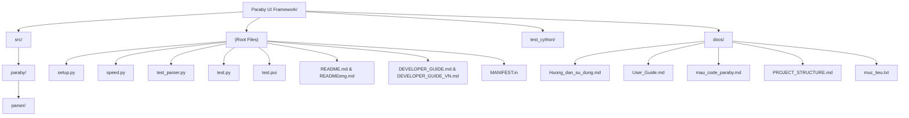

# 📂 Báo cáo Kiến trúc Toàn diện Paraby UI Framework (Version 3.0)

Dưới đây là sơ đồ chi tiết và danh sách **toàn bộ** các thư mục và tệp tin trong dự án của bạn (kèm số dòng mã - LOC và chức năng).

---

## 🗺️ Sơ đồ Cây Thư Mục (Directory Tree)

---

## 📄 Thư mục Gốc (Root)

Đây là các tệp cấu hình, khởi chạy, kiểm thử và tài liệu tổng quan.

| File | Số dòng | Mô tả chức năng |
| :--- | :---: | :--- |
| [setup.py](../setup.py) | 54 | Cấu hình đóng gói PyPI và biên dịch Cython Extensions (.pyx -> .so). Tích hợp phiên bản `v3.0.0`. |
| [speed.py](../speed.py) | 64 | Công cụ Benchmark, so sánh tốc độ xử lý giữa Pure Python và Cython (giúp chứng minh hiệu năng x1.65 / +35%). |
| [test_parser.py](../test_parser.py) | 45 | Bộ kiểm thử tự động (Unit Tests) bằng `pytest` để xác minh Cython AST sinh mã chính xác. |
| [test.py](../test.py) | 43 | Script chạy thử UI. |
| [test.pui](../test.pui) | 46 | Tệp giao diện mẫu (DSL chuẩn) để thử nghiệm tính năng biên dịch. |
| [README.md](../README.md) | 69 | Giới thiệu dự án, tính năng nổi bật (Tiếng Việt). |
| [READMEeng.md](../READMEeng.md) | 73 | Giới thiệu dự án (Tiếng Anh). |
| [DEVELOPER_GUIDE_VN.md](../DEVELOPER_GUIDE_VN.md) | 98 | Tài liệu chuyên sâu cho lập trình viên (Tiếng Việt). |
| [DEVELOPER_GUIDE.md](../DEVELOPER_GUIDE.md) | 136 | Tài liệu chuyên sâu cho lập trình viên (Tiếng Anh). |
| [MANIFEST.in](../MANIFEST.in) | 5 | Khai báo các file ngoài mã nguồn cần đưa vào khi build gói PyPI (như `.pui`). |

---

## ⚙️ Thư mục `src/paraby/` (Cốt lõi Python Runtime)

Thư mục này quản lý toàn bộ giao diện và thao tác chạy khi ứng dụng Paraby lên sóng.

| File | Số dòng | Mô tả chức năng |
| :--- | :---: | :--- |
| [\_\_init\_\_.py](../src/paraby/__init__.py) | 430 | Điểm khởi đầu. Chứa logic load `.pui`, quản lý module và dummy classes (Gợi ý code IDE). |
| [runtime.py](../src/paraby/runtime.py) | 9 | Facade (Mặt tiền) tự động import toàn bộ các hàm runtime phụ, giữ nguyên chuẩn giao tiếp cũ. |
| [widgets.py](../src/paraby/widgets.py) | 225 | Trái tim giao diện: Khởi tạo các Widgets, xếp layout (place), và thuật toán phát hiện màu chữ trùng màu nền (Smart contrast). |
| [window.py](../src/paraby/window.py) | 49 | Khởi tạo cửa sổ chính hoặc cửa sổ con phụ (Toplevel), quản lý mainloop và logo `.app`. |
| [colors.py](../src/paraby/colors.py) | 56 | Bản đồ màu sắc (Color Map). Phân giải tự động `"red"` thành tuple sáng/tối hỗ trợ Dark Mode. |
| [events.py](../src/paraby/events.py) | 29 | Xử lý gán sự kiện (`bind_event`) thông minh, tự động phân loại `click`, `change`, `press_enter`. |
| [patch.py](../src/paraby/patch.py) | 90 | Chứa logic "Monkey-patch": Tiêm ma thuật trực tiếp vào CustomTkinter (thuộc tính `.text`, `.value`). |
| [cli.py](../src/paraby/cli.py) | 110 | Trình dòng lệnh CLI (`paraby run`, `paraby build`). |
| [\_\_main\_\_.py](../src/paraby/__main__.py) | 12 | Định tuyến cho CLI khi gọi qua python module `python -m paraby`. |
| [help.pui](../src/paraby/help.pui) | 22 | Tệp UI trình diễn hướng dẫn (Showroom mode). |

---

## 🚀 Thư mục `src/paraby/parser/` (Cython Compiler Engine)

Động cơ siêu tốc của hệ thống. Tối ưu cực mạnh thông qua biên dịch C.

| File | Số dòng | Mô tả chức năng |
| :--- | :---: | :--- |
| [transpiler.pyx](../src/paraby/parser/transpiler.pyx) | 15 | Facade điều phối bộ máy dịch C. Chạy chuỗi: `clean_lines` -> `build_ast` -> `generate_python`. |
| [lexer.pyx](../src/paraby/parser/lexer.pyx) | 87 | Bộ phân tích từ vựng. Đọc văn bản, loại bỏ dấu `#`, ghép token, bảo lưu khối mã Python. |
| [ast_builder.pyx](../src/paraby/parser/ast_builder.pyx) | 145 | Phân tích Token và tạo thành Cây cú pháp (AST) chia luồng rõ rệt giữa Window, Widget và Vòng lặp. |
| [codegen.pyx](../src/paraby/parser/codegen.pyx) | 139 | Dịch ngược cây AST thành code khởi tạo `CustomTkinter` Python nguyên thủy siêu mượt. |
| [constants.py](../src/paraby/parser/constants.py) | 34 | Chứa `WIDGET_ALIASES` quy định Bí danh (`btn`, `nút_bấm`). |
| [\_\_init\_\_.py](../src/paraby/parser/__init__.py) | 1 | Khởi tạo module rỗng. |
| [transpiler.pyi](../src/paraby/parser/transpiler.pyi) | 1 | Dummy file gợi ý Type Hint cho bộ parser. |

---

## 📚 Thư mục `docs/` (Cẩm nang hướng dẫn)

Các tài liệu bổ sung (chủ yếu là cho người dùng).

| File | Số dòng | Mô tả chức năng |
| :--- | :---: | :--- |
| [Huong_dan_su_dung.md](../docs/Huong_dan_su_dung.md) | 232 | Sách HDSD tiếng Việt tổng hợp mọi cú pháp, widget của Paraby. |
| [User_Guide.md](../docs/User_Guide.md) | 242 | Sách HDSD phiên bản tiếng Anh. |
| [mau_code_paraby.md](../docs/mau_code_paraby.md) | 200 | Tuyển tập các đoạn code mẫu copy-paste cực lẹ cho lập trình viên. |
| [PROJECT_STRUCTURE.md](../docs/PROJECT_STRUCTURE.md) | 110+ | Tệp báo cáo kiến trúc dự án (chính là tệp bạn đang xem). |
| [muc_tieu.txt](../docs/muc_tieu.txt) | 12 | Ghi chú các định hướng và mục tiêu cốt lõi của Paraby Framework. |

---

## 🧪 Thư mục `test_cython/`

Khu vực kiểm thử độc lập dành riêng cho các thành phần Cython gốc (trước khi chia module).

| File | Số dòng | Mô tả chức năng |
| :--- | :---: | :--- |
| [transpiler_py.py](../test_cython/transpiler_py.py) | 376 | Bản sao trình biên dịch viết bằng Pure Python để file `speed.py` benchmark trực tiếp với `.so`. |
| [\_\_init\_\_.py](../test_cython/__init__.py) | 0 | Đánh dấu module Python. |

---
**Tổng cộng toàn bộ các file trong dự án hiện tại chứa khoảng 2862 dòng code.** 
Bạn có thể dễ dàng click chuột trái thẳng vào tên của bất kỳ tệp nào trong cột `File` ở bên trên để mở ngay tệp đó trên Editor (IDE) hoặc GitHub!
