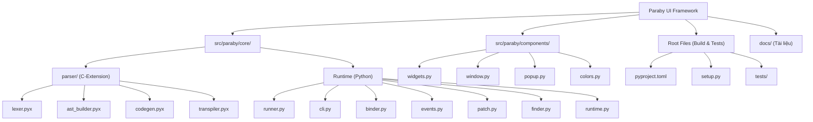

# 📂 Báo cáo Kiến trúc Paraby UI Framework (Version 3.2)

Dưới đây là sơ đồ chi tiết, danh sách toàn bộ các file cốt lõi trong dự án, số dòng mã (Line of Code - LOC), chức năng, và liên kết trực tiếp tới file đó để bạn dễ dàng truy cập.

---

## 🗺️ Sơ đồ Kiến trúc Tổng quan (Mermaid)

---

## 📄 Chi tiết Thư mục Core: `src/paraby/core/`

Thư mục này chứa logic vận hành (Runtime) nền tảng của Paraby, bao gồm cơ chế nạp file, phân tích CLI và monkey-patching.

| File | Mô tả chức năng |
| :--- | :--- |
| `__init__.py` | File chính xuất (export) framework. Định tuyến các hàm khởi tạo giao diện và parser. |
| `runner.py` | Cung cấp hàm nạp ứng dụng (`load`, `run`) thực sự và popup hỗ trợ từ script. |
| `runtime.py` | Quản lý các hàm runtime tạo widget, tạo window, hiển thị và vòng lặp `start_app()`. |
| `binder.py` | Chứa class `StateBinder` quản lý State và tiêm (inject) widget ra global namespace, xử lý Inline Events thông qua AST. |
| `cli.py` | Trình giao diện dòng lệnh (Command Line Interface), hỗ trợ `paraby run`, `paraby demo`, v.v. |
| `events.py` | Xử lý logic gán (bind) các sự kiện nhúng vào các Widget tương ứng. |
| `finder.py` | Định nghĩa Custom Importer (`ParabyFinder`), cho phép Python import trực tiếp file `.pui` như module. |
| `patch.py` | Logic "Monkey-patching" vào CustomTkinter hỗ trợ gọi trực tiếp biến và properties, có thể tắt qua cờ `PARABY_DISABLE_PATCH`. |

---

## 📄 Chi tiết Thư mục Components: `src/paraby/components/`

Chứa các khối giao diện (Widgets, Windows) của framework.

| File | Mô tả chức năng |
| :--- | :--- |
| `widgets.py` | Trái tim giao diện: Khởi tạo tất cả Widgets, tính toán vị trí hiển thị (place), cảnh báo thông minh nếu màu chữ trùng màu nền. |
| `window.py` | Chứa logic khởi tạo Main Window (CTk) hoặc Popup Window (CTkToplevel). |
| `popup.py` | Triển khai các dialogs cảnh báo nhanh: `alert`, `confirm`, `prompt`. |
| `colors.py` | Bản đồ màu sắc (Color Map) hiện đại, tự động chuyển đổi chuỗi tên màu sang dải màu hỗ trợ Light/Dark mode. |

---

## ⚙️ Chi tiết Bộ Biên Dịch: `src/paraby/core/parser/` (Cython)

Đây là "động cơ" làm nên tốc độ siêu nhanh của Paraby.

| File | Mô tả chức năng |
| :--- | :--- |
| `ast_builder.pyx` | Phân tích Token và dựng lên **Cây cú pháp trừu tượng (AST)**, đảm bảo an toàn không còn lỗi injection. |
| `codegen.pyx` | Duyệt cây AST và dịch ngược ra mã nguồn `CustomTkinter` Python nguyên chất. |
| `lexer.pyx` | Bộ phân tích từ vựng chịu trách nhiệm đọc từng dòng, làm sạch khoảng trắng. |
| `constants.py` | Chứa từ điển `WIDGET_ALIASES` quy định bí danh (như `btn`, `nút_bấm`). |
| `widget_registry.py` | Quản lý các loại type mapping cho hint code tự động. |
| `transpiler.pyx` | Facade điều phối bộ dịch. Nó chạy pipeline: `clean_lines()` -> `build_ast()` -> `generate_python()`. |

---

## 🛠️ Thư mục Gốc (Root) & Công cụ (Tools)

Chứa các công cụ dùng để biên dịch, kiểm thử, và tài liệu phát triển.

| File | Mô tả chức năng |
| :--- | :--- |
| `pyproject.toml` | Build-system hiện đại theo chuẩn PEP 517 hỗ trợ build wheel. |
| `setup.py` | File cấu hình bản lề quản lý việc biên dịch các file `.pyx` sang file C-Extension `.so`. |
| `DEVELOPER_GUIDE.md` | Hướng dẫn phát triển và mở rộng framework (Tiếng Anh). |
| `DEVELOPER_GUIDE_VN.md` | Hướng dẫn phát triển và mở rộng framework (Tiếng Việt). |
| `README.md` | Giới thiệu dự án, các tính năng nổi bật. |
| `READMEeng.md` | Bản giới thiệu dự án bằng Tiếng Anh. |

**Version 3.2 Update:** Kiến trúc mới tách rõ ràng `core/` và `components/` giúp bảo trì dễ dàng, đồng thời hệ thống build cũng được chuẩn hóa qua `pyproject.toml`.

