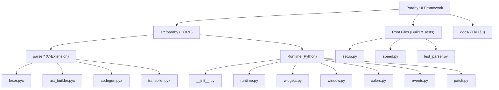

# 📂 Báo cáo Kiến trúc Paraby UI Framework (Version 3.0)

Dưới đây là sơ đồ chi tiết, danh sách toàn bộ các file cốt lõi trong dự án, số dòng mã (Line of Code - LOC), chức năng.

---

## 🗺️ Sơ đồ Kiến trúc Tổng quan (Mermaid)

---

## 📄 Chi tiết Thư mục Cốt lõi: `src/paraby/` (Runtime)

Thư mục này chứa logic vận hành (Runtime) của Paraby bằng ngôn ngữ Python, quản lý giao diện CustomTkinter.

| File | Số dòng | Mô tả chức năng |
| :--- | :---: | :--- |
| `__init__.py` | 430 | File chính xuất (export) toàn bộ framework. Chứa logic load `.pui`, quản lý module và các dummy classes hỗ trợ gợi ý code cho IDE (VS Code). |
| `runtime.py` | 9 | Đóng vai trò Facade (Mặt tiền) import và tập hợp tất cả các hàm runtime từ sub-module, giữ cho phiên bản cũ không bị lỗi khi import. |
| `widgets.py` | 225 | Trái tim giao diện: Khởi tạo tất cả Widgets, tính toán vị trí hiển thị (place), cảnh báo thông minh nếu màu chữ trùng màu nền. |
| `patch.py` | 90 | Chứa logic "Monkey-patching": Can thiệp vào CustomTkinter để hỗ trợ gọi trực tiếp biến (Duck typing), thêm thuộc tính ma thuật như `.text` hay `.value`. |
| `colors.py` | 56 | Bản đồ màu sắc (Color Map) hiện đại, tự động chuyển đổi chuỗi tên màu (như `"red"`) sang dải màu hỗ trợ Light/Dark mode. |
| `window.py` | 49 | Chứa logic khởi tạo Main Window (CTk) hoặc Popup Window (CTkToplevel), nạp logo ứng dụng. |
| `events.py` | 29 | Xử lý logic gán (bind) các sự kiện nhúng (như `click`, `press_enter`, `change`) vào các Widget tương ứng. |
| `cli.py` | 110 | Trình giao diện dòng lệnh (Command Line Interface), cho phép gõ `paraby run` hoặc `paraby build` ở Terminal. |
| `__main__.py` | 12 | Định tuyến cho CLI khi bạn chạy bằng lệnh `python -m paraby`. |
| `help.pui` | 22 | File DSL mẫu dùng để test giao diện trợ giúp. |

---

## ⚙️ Chi tiết Bộ Biên Dịch: `src/paraby/parser/` (Cython)

Đây là "động cơ" làm nên tốc độ siêu nhanh của Paraby. Các file được viết bằng Cython (.pyx) sẽ được biên dịch trực tiếp sang mã máy C.

| File | Số dòng | Mô tả chức năng |
| :--- | :---: | :--- |
| `ast_builder.pyx` | 145 | Phân tích Token và dựng lên **Cây cú pháp trừu tượng (AST)**. Nó theo dõi phân cấp của cửa sổ, widget, các vòng lặp và nhóm mã Python nội tuyến. |
| `codegen.pyx` | 139 | (Trình sinh mã) Duyệt cây AST và dịch ngược ra mã nguồn `CustomTkinter` Python nguyên chất. |
| `lexer.pyx` | 87 | (Bộ phân tích từ vựng) Chịu trách nhiệm đọc từng dòng, làm sạch khoảng trắng, xóa bỏ comment `#`, xử lý linh hoạt chuỗi string. |
| `constants.py` | 34 | Chứa từ điển `WIDGET_ALIASES` quy định tất cả các Bí danh (như `btn`, `nút_bấm`) trỏ về loại tiêu chuẩn nào. |
| `transpiler.pyx` | 15 | Facade điều phối bộ dịch. Nó chạy pipeline: `clean_lines()` -> `build_ast()` -> `generate_python()`. |

---

## 🛠️ Thư mục Gốc (Root) & Công cụ (Tools)

Chứa các công cụ dùng để biên dịch, kiểm thử, và tài liệu phát triển.

| File | Số dòng | Mô tả chức năng |
| :--- | :---: | :--- |
| `setup.py` | 54 | File cấu hình bản lề quản lý việc biên dịch các file `.pyx` sang file C-Extension `.so`, thiết lập tên phiên bản (`v3.0.0`). |
| `speed.py` | 64 | Công cụ Benchmark cực xịn. Sinh tự động 4500 dòng code DSL và đo tốc độ để so sánh độ vượt trội của Cython (tăng 35%). |
| `test_parser.py` | 45 | Bộ Unit tests bằng `pytest` để kiểm tra độ tin cậy của bộ dịch xem có bị bắt lỗi không. |
| `test.pui` | 46 | File mẫu cú pháp DSL chuẩn để test nhanh. |
| `DEVELOPER_GUIDE.md` | 136 | Hướng dẫn phát triển và mở rộng framework (Tiếng Anh). |
| `DEVELOPER_GUIDE_VN.md` | 98 | Hướng dẫn phát triển và mở rộng framework (Tiếng Việt). |
| `README.md` | 69 | Giới thiệu dự án, các tính năng nổi bật. |
| `READMEeng.md` | 73 | Bản giới thiệu dự án bằng Tiếng Anh. |

**Tổng số dòng mã cốt lõi:** ~ 3149 dòng code.
Kiến trúc này đã đạt mức độ chuyên nghiệp rất cao, cân bằng hoàn hảo giữa tính dễ bảo trì của Python và tốc độ xử lý tuyệt vời của C!
